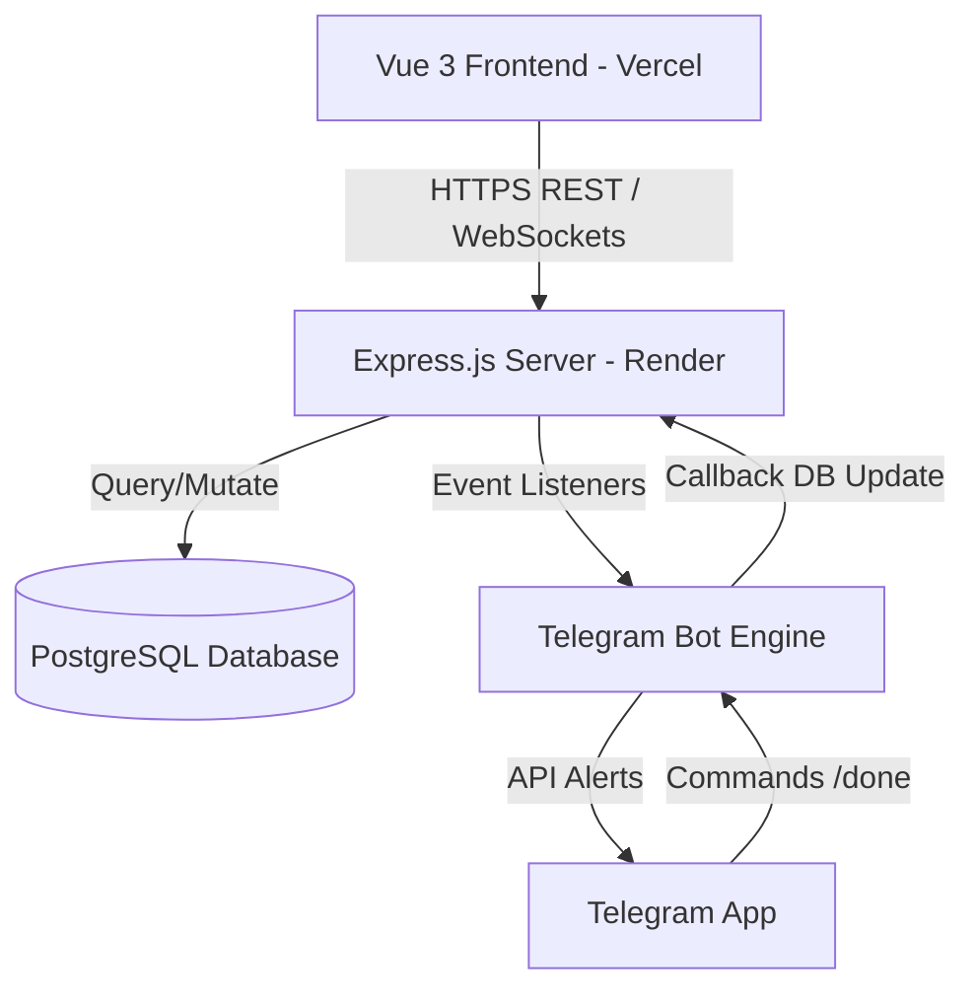

# System Architecture & Folder Structure

## 1. System Overview
The IT Helpdesk system is built on a decoupled, modern multi-tier fullstack architecture:



*   **Frontend (FE):** Built with Vue 3 (Vite, TypeScript, Pinia, Vue Router) and styled with Vanilla CSS + Tailwind. Deployed to Vercel. Connects to backend via HTTP REST endpoints and persistent WebSockets for live data sync.
*   **Backend (BE):** Built with Node.js, Express, TypeScript, and Drizzle ORM. Deployed to Render. Integrates an Express web server and a native WebSocket Server (`ws`) sharing the same port.
*   **Database:** PostgreSQL database instance, managed with Drizzle ORM schemas and migrations.
*   **Real-time Notifications:** Telegraf-based Telegram Bot running inside the backend event loop to alert technicians and allow remote ticket resolution.

---

## 2. Folder Structure Overview

```text
it_helpdesk/
├── backend/                       # Backend Application (Node.js/Express)
│   ├── src/
│   │   ├── bot/                   # Telegram Bot commands and setup
│   │   │   └── index.ts
│   │   ├── db/                    # Drizzle Database configuration
│   │   │   ├── index.ts
│   │   │   └── schema.ts          # Database tables and relations
│   │   └── index.ts               # REST API endpoints & WebSocket Server
│   ├── drizzle.config.ts          # Schema configurations for migrations
│   ├── package.json
│   └── tsconfig.json
│
├── src/                           # Frontend Application (Vue 3/Vite)
│   ├── app/
│   │   └── components/            # Vue Pages & Components
│   │       ├── admin/             # Admin Dashboard, Ticket/Staff Admin Views
│   │       ├── user/              # User Portal, Submit, Detail, FAQ Views
│   │       ├── shared/            # Shared Badge, SLA, and Skeleton components
│   │       ├── Login.vue
│   │       └── RoleSelector.vue   # Landing page entrypoint
│   ├── components/ui/             # Shadcn Vue components
│   ├── composables/               # Vue composables (useAuth, etc.)
│   ├── router/                    # Vue Router configurations
│   │   └── index.ts
│   ├── stores/                    # Pinia States (useTicketStore with WebSockets)
│   │   ├── useNotificationStore.ts
│   │   └── useTicketStore.ts
│   ├── styles/                    # Global stylesheets
│   ├── App.vue
│   └── main.ts
│
├── dist/                          # Production Frontend Build
├── index.html
├── package.json
└── vite.config.ts
```

---

## 3. Communication Protocols
*   **HTTP REST APIs:** Handled by Express.js routers for CRUD operations like fetching tickets, submitting reviews, commenting, and user registration.
*   **WebSockets:** Standard native WebSockets protocol setup. When a state change happens on the backend, it broadcasts a JSON notification payload to all connected clients. Clients immediately run a silent background fetch to sync data without forcing heavy page refreshes.
*   **Telegram Updates:** Long polling handled via `telegraf` listening for groups setup and command inputs (`/daftar`, `/done`).
