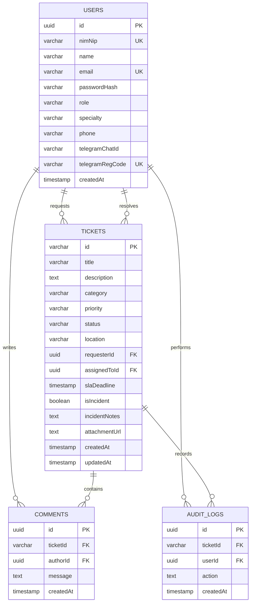

# Database Schema & Structure Documentation

This application uses PostgreSQL, managed via **Drizzle ORM** for type-safe queries, schemas, and relational mapping.

---

## 1. Tables Schema

### USERS Table
Represents both clients (Students & Lecturers) and helpdesk support team staff (Admins & Technicians).
*   `id`: `uuid`, Primary Key (auto-generated random uuid)
*   `nimNip`: `varchar(50)`, Unique, Not Null. Serves as login credentials identifier.
*   `name`: `varchar(100)`, Not Null.
*   `email`: `varchar(100)`, Unique, Not Null.
*   `passwordHash`: `varchar(255)`, Not Null.
*   `role`: `varchar(20)`, Not Null (e.g. `'Mahasiswa'`, `'Dosen'`, `'Admin IT'`, `'Teknisi'`).
*   `specialty`: `varchar(50)`. Technician specialty (e.g. `'Jaringan'`, `'Perangkat'`).
*   `phone`: `varchar(20)`.
*   `telegramChatId`: `varchar(50)`. Binds registered technician account with Telegram Chat ID.
*   `telegramRegCode`: `varchar(20)`, Unique. Registration token generated for Telegram linkage.
*   `createdAt`: `timestamp`, Default current time.

### TICKETS Table
Maintains helpdesk issue tickets and tracking lifecycle.
*   `id`: `varchar(20)`, Primary Key (e.g., `'#1001'`).
*   `title`: `varchar(255)`, Not Null.
*   `description`: `text`, Not Null.
*   `category`: `varchar(50)`, Not Null.
*   `priority`: `varchar(20)`, Not Null (e.g., `'High'`, `'Medium'`, `'Low'`).
*   `status`: `varchar(20)`, Not Null (e.g., `'Open'`, `'In Progress'`, `'Pending'`, `'Resolved'`, `'Closed'`).
*   `location`: `varchar(100)`, Not Null.
*   `requesterId`: `uuid`, Foreign Key references `USERS.id`, Not Null.
*   `assignedToId`: `uuid`, Foreign Key references `USERS.id`, Nullable.
*   `slaDeadline`: `timestamp`, Not Null. Calculated dynamically based on priority (`High` = 4h, `Medium` = 8h, `Low` = 24h).
*   `isIncident`: `boolean`, Default `false`, Not Null. Flagged true if ticket is marked as a major incident.
*   `incidentNotes`: `text`.
*   `attachmentUrl`: `text`. Holds base64 encoded image strings.
*   `createdAt`: `timestamp`, Default current time.
*   `updatedAt`: `timestamp`, Default current time.

### COMMENTS Table
Manages communication logs on the ticket detail page.
*   `id`: `uuid`, Primary Key.
*   `ticketId`: `varchar(20)`, Foreign Key references `TICKETS.id`, Not Null.
*   `authorId`: `uuid`, Foreign Key references `USERS.id`, Not Null.
*   `message`: `text`, Not Null.
*   `createdAt`: `timestamp`, Default current time.

### AUDIT_LOGS Table
Audit history tracking every lifecycle and assignment event.
*   `id`: `uuid`, Primary Key.
*   `ticketId`: `varchar(20)`, Foreign Key references `TICKETS.id`, Not Null.
*   `userId`: `uuid`, Foreign Key references `USERS.id`, Not Null.
*   `action`: `text`, Not Null. Detail of the audit action.
*   `createdAt`: `timestamp`, Default current time.

---

## 2. Relations Configuration

Drizzle Relations helper (`relations`) configuration is implemented in `schema.ts` to support nested queries:
*   **Users Relations:**
    *   `ticketsRequested`: One-to-Many relation with `TICKETS` table (relationName: `'requester'`).
    *   `ticketsAssigned`: One-to-Many relation with `TICKETS` table (relationName: `'assignee'`).
    *   `comments`: One-to-Many relation with `COMMENTS` table.
    *   `auditLogs`: One-to-Many relation with `AUDIT_LOGS` table.
*   **Tickets Relations:**
    *   `requester`: Many-to-One relation with `USERS` (references `requesterId` -> `users.id`, relationName: `'requester'`).
    *   `assignee`: Many-to-One relation with `USERS` (references `assignedToId` -> `users.id`, relationName: `'assignee'`).
    *   `comments`: One-to-Many relation with `COMMENTS` table.
    *   `auditLogs`: One-to-Many relation with `AUDIT_LOGS` table.
